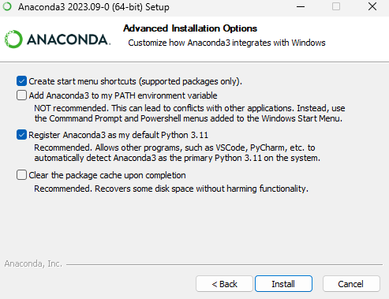
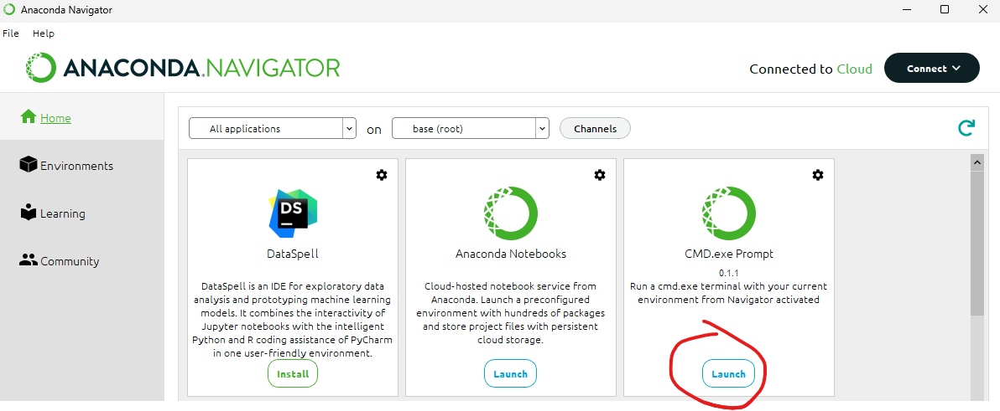
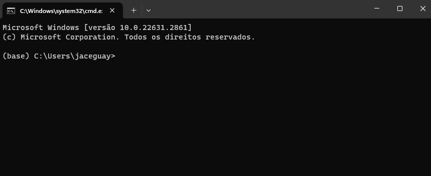
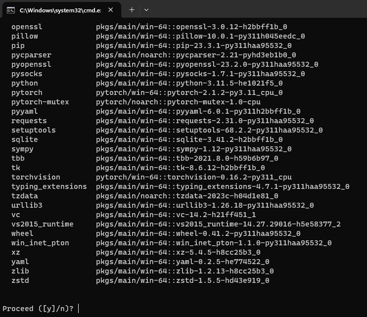
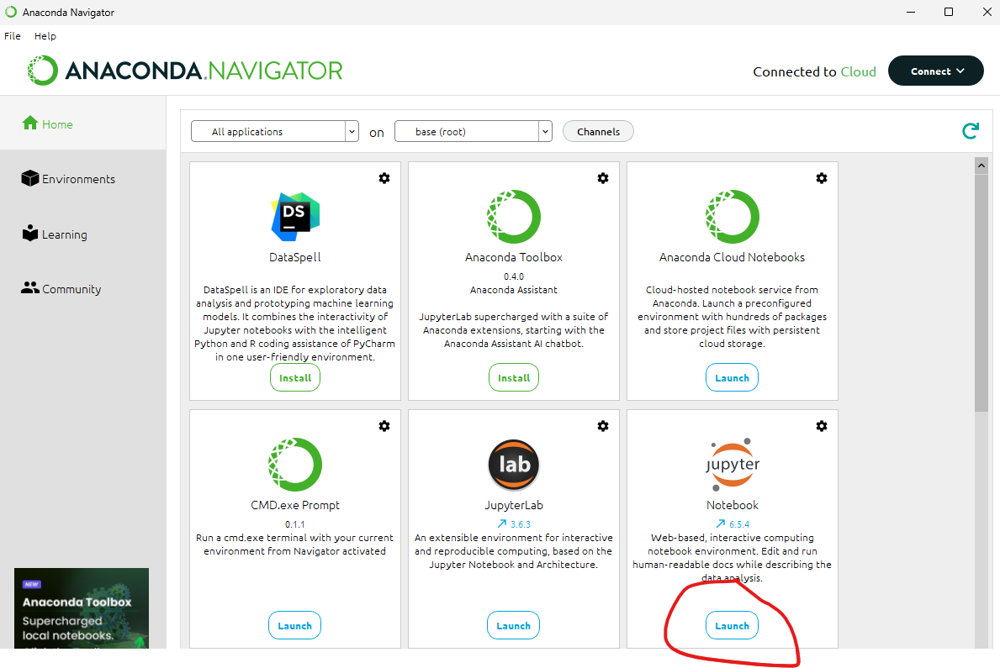
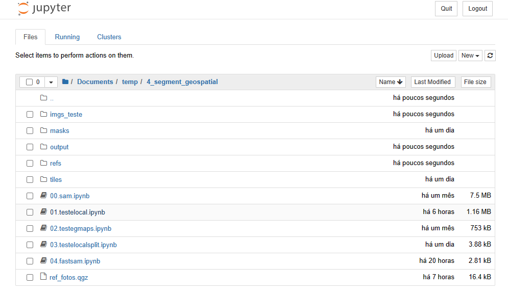
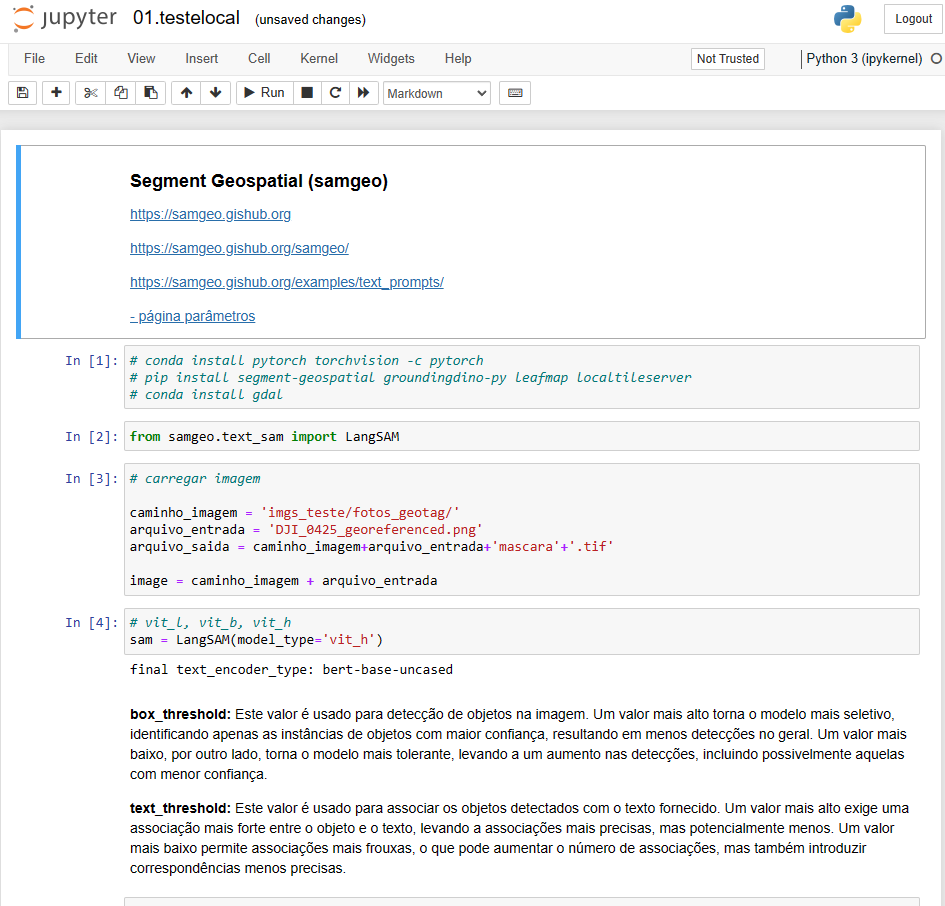

### Programas

#### 1. anaconda:

https://www.anaconda.com/download



#### 2. dentro do anaconda navigator:


Agora com o anaconda instalado, antes de lançar o jupyter Notebook, é necessario instalar as bibliotecas, para isso, abra o prompt de comando:



Quando abrir o prompt, vai perceber o (base) na frente, isto significa que o ambiente em uso é este, base.



Para instalar as bibliotecas, digite:

```bash
conda install pytorch torchvision -c pytorch
```

Ele irá pedir uma confirmação, digite "y" e aperte enter.



Bibliotecas necessárias:

```bash
conda install gdal
```

E o segment-geospatial não está no conda, então instale pelo pip, ele nem pedirá confirmação:

```bash
pip install segment-geospatial groundingdino-py leafmap localtileserver
```

### Após a instalação das bibliotecas, abra o jupyter notebook




Agora em diante basta navegar até o diretório onde se encontram os arquivos .ipynb e abrir.



